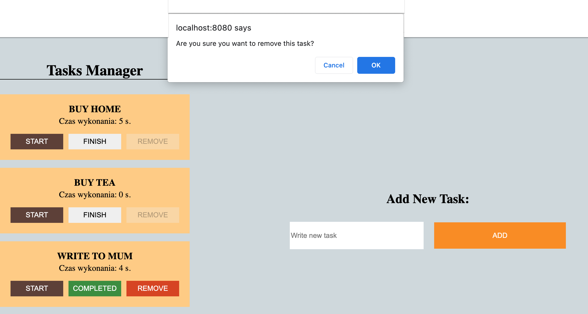

# Tasks Manager Project - React

## About the project:
The aim of the project was to create application "Tasks Manager", user can add new task and measure time to finish it.

Features:
* user can add a new task by form
* user can measure the time - only one task can be running at the same time
* user can stop the time using button "STOP" or "FINISH"
* only "COMPLETED" task can be removed
* "COMPLETED" task is move to the end the list
* "REMOVED" task is not showing but is in the state still
* every change in task like: time (start, stop), finish, remove is save in API

When working on it I used JSON server as my local API.


## How to see it
Please, refer to the screenshots, which are attached below. Moreover, I am working on a form of a video preview as an additional reference guide.

## Technologies:
* JavaScript
* React
* HTML
* CSS
* JSON Server
* Desktop only version

## Solutions
By creating this project I had an opportunity to practice/learn:
* what is it "Lifecycle of Components" and what is important
* how and when to use lifecycle methods
* how to work with state, how to update values using this.setState method
* how to use events in React
* why we need to bind event handlers in class and how to ommit it using plugin using babel transpilator
* controlled vs. uncontrolled components in React
* conditional rendering 

Using fetch method after render component in componentDidMount function
```
 async componentDidMount(){
        try{
            const response = await fetch(`${this.api}`);
            const tasks = await response.json();
            this.setState({tasks})
        }
        catch(error){
            console.error(error.message);
        }
    }
```
Conditional Rendering
```
startStopHandler = item => {
        const {isRunning} = item;
        isRunning ? this.stopHandler(item.id) : this.startHandler(item.id);
    }
```

Taking data from inputs and update the state
```
changeHandler = e => {
        const {name,value} = e.target;
        this.setState({
            [name]:value
        });
    }

<input className='task__input' name="task" onChange={this.changeHandler} value={this.state.task} placeholder='Write new task' />
```

Working on this project I have tried to split the code into a small function (Single-responsibility principle).

I didn't have more time to work on appearance of application, but in a free time I am going to upgrade this. Right now, you can check my other projects where I focused on design and practiced CSS3.
* [LandingPage-HTML-CSS](https://github.com/EwelinaKopacz/LandingPage-HTML-CSS)
* [LandingPage-RWD](https://github.com/EwelinaKopacz/LandingPage-RWD)
* [LandingPage-CuDanusie](https://github.com/EwelinaKopacz/LandingPage-CuDanusie)


### Project preview
List of tasks


Confirmation before remove task


### Feel free to contact me:
* [Linkedin](https://www.linkedin.com/in/ewelina-kopacz-929559100/) - Ewelina Kopacz

### Sources:
* [Conditional Rendering](https://pl.reactjs.org/docs/conditional-rendering.html)
* [React Lifecycle Methods Diagram](https://projects.wojtekmaj.pl/react-lifecycle-methods-diagram/)

### Thanks for project and support to Mateusz Bogolubow:
* Mentor i Trener Programowania JavaScript - [DevMentor](https://devmentor.pl/) - Mateusz Bogolubow